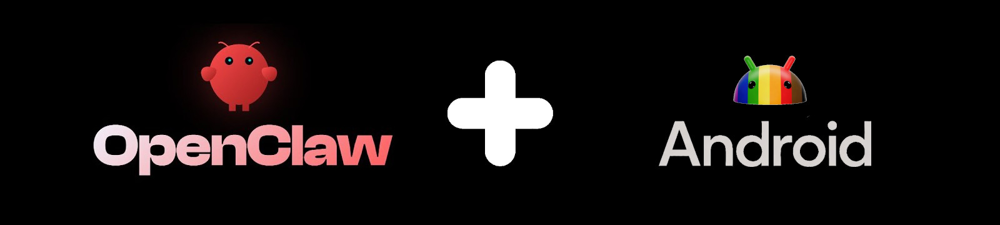

# OpenClaw on Android




Because Android deserves a shell.

## No Linux install required

The standard approach to running OpenClaw on Android requires installing proot-distro with Linux, adding 700MB-1GB of overhead. OpenClaw on Android eliminates this by installing just the glibc dynamic linker (ld.so), letting you run OpenClaw without a full Linux distribution.

**Standard approach**: Install a full Linux distribution in Termux via proot-distro.

```
┌───────────────────────────────────────────────────┐
│ Linux Kernel                                      │
│ ┌───────────────────────────────────────────────┐ │
│ │ Android · Bionic libc · Termux                │ │
│ │ ┌───────────────────────────────────────────┐ │ │
│ │ │ proot-distro · Debian/Ubuntu              │ │ │
│ │ │ ┌───────────────────────────────────────┐ │ │ │
│ │ │ │ GNU glibc                             │ │ │ │
│ │ │ │ Node.js → OpenClaw                    │ │ │ │
│ │ │ └───────────────────────────────────────┘ │ │ │
│ │ └───────────────────────────────────────────┘ │ │
│ └───────────────────────────────────────────────┘ │
└───────────────────────────────────────────────────┘
```

**This project**: No proot-distro — just the glibc dynamic linker.

```
┌───────────────────────────────────────────────────┐
│ Linux Kernel                                      │
│ ┌───────────────────────────────────────────────┐ │
│ │ Android · Bionic libc · Termux                │ │
│ │ ┌───────────────────────────────────────────┐ │ │
│ │ │ glibc ld.so (linker only)                 │ │ │
│ │ │ ld.so → Node.js → OpenClaw                │ │ │
│ │ └───────────────────────────────────────────┘ │ │
│ └───────────────────────────────────────────────┘ │
└───────────────────────────────────────────────────┘
```

| | Standard (proot-distro) | This project |
|---|---|---|
| Storage overhead | 1-2GB (Linux + packages) | ~200MB |
| Setup time | 20-30 min | 3-10 min |
| Performance | Slower (proot layer) | Native speed |
| Setup steps | Install distro, configure Linux, install Node.js, fix paths... | Run one command |

##  Claw App

A standalone Android app is also available. It bundles a terminal emulator and a WebView-based UI into a single APK — no Termux required.

- One-tap setup: bootstrap, Node.js, and OpenClaw installed from within the app
- Built-in dashboard for gateway control, runtime info, and tool management
- Works independently of Termux — installing the app does not affect an existing Termux + `oa` setup

Download the APK from the [Releases](https://github.com/AidanPark/openclaw-android/releases) page.


## Requirements

- Android 7.0 or higher (Android 10+ recommended)
- ~1GB free storage
- Wi-Fi or mobile data connection

## What It Does

The installer automatically resolves the differences between Termux and standard Linux. There's nothing you need to do manually — the single install command handles all of these:

1. **glibc environment** — Installs the glibc dynamic linker (via pacman's glibc-runner) so standard Linux binaries run without modification
2. **Node.js (glibc)** — Downloads official Node.js linux-arm64 and wraps it with an ld.so loader script (no patchelf, which causes segfault on Android)
3. **Path conversion** — Automatically converts standard Linux paths (`/tmp`, `/bin/sh`, `/usr/bin/env`) to Termux paths
4. **Temp folder setup** — Configures an accessible temp folder for Android
5. **Service manager bypass** — Configures normal operation without systemd
6. **OpenCode integration** — If selected, installs OpenCode using proot + ld.so concatenation for Bun standalone binaries

## Step-by-Step Setup (from a fresh phone)

1. [Prepare Your Phone](#step-1-prepare-your-phone)
2. [Install Termux](#step-2-install-termux)
3. [Initial Termux Setup](#step-3-initial-termux-setup)
4. [Install OpenClaw](#step-4-install-openclaw) — one command
5. [Start OpenClaw Setup](#step-5-start-openclaw-setup)
6. [Start OpenClaw (Gateway)](#step-6-start-openclaw-gateway)

### Step 1: Prepare Your Phone

Configure Developer Options, Stay Awake, charge limit, and battery optimization. See the [Keeping Processes Alive guide](docs/disable-phantom-process-killer.md) for step-by-step instructions.

### Step 2: Install Termux

> **Important**: The Play Store version of Termux is discontinued and will not work. You must install from F-Droid.

1. Open your phone's browser and go to [f-droid.org](https://f-droid.org)
2. Search for `Termux`, then tap **Download APK** to download and install
   - Allow "Install from unknown sources" when prompted

### Step 3: Initial Termux Setup

Open the Termux app and paste the following command to install curl (needed for the next step).

```bash
pkg update -y && pkg install -y curl
```

> You may be asked to choose a mirror on first run. Pick any — a geographically closer mirror will be faster.


### Step 4: Install OpenClaw

> **Tip: Use SSH for easier typing**
> From this step on, you can type commands from your computer keyboard instead of the phone screen. See the [Termux SSH Setup Guide](docs/termux-ssh-guide.md) for details.

Paste the following command in Termux.

```bash
curl -sL myopenclawhub.com/install | bash && source ~/.bashrc
```

Everything is installed automatically with a single command. This takes 3–10 minutes depending on network speed and device. Wi-Fi is recommended.

Once complete, the OpenClaw version is displayed along with instructions to run `openclaw onboard`.

### Step 5: Start OpenClaw Setup

As instructed in the installation output, run:

```bash
openclaw onboard
```

Follow the on-screen instructions to complete the initial setup.


### Step 6: Start OpenClaw (Gateway)

Once setup is complete, start the gateway:

> **Important**: Run `openclaw gateway` directly in the Termux app on your phone, not via SSH. If you run it over SSH, the gateway will stop when the SSH session disconnects.

The gateway occupies the terminal while running, so open a new tab for it. Tap the **hamburger icon (☰)** on the bottom menu bar, or swipe right from the left edge of the screen (above the bottom menu bar) to open the side menu. Then tap **NEW SESSION**.


In the new tab, run:

```bash
openclaw gateway
```


> To stop the gateway, press `Ctrl+C`. Do not use `Ctrl+Z` — it only suspends the process without terminating it.

## Keeping Processes Alive

Android may kill background processes or throttle them when the screen is off. See the [Keeping Processes Alive guide](docs/disable-phantom-process-killer.md) for all recommended settings (Developer Options, Stay Awake, charge limit, battery optimization, and Phantom Process Killer).

## Access the Dashboard from Your PC

See the [Termux SSH Setup Guide](docs/termux-ssh-guide.md) for SSH access and dashboard tunnel setup.

## Managing Multiple Devices

If you run OpenClaw on multiple devices on the same network, use the <a href="https://myopenclawhub.com" target="_blank">Dashboard Connect</a> tool to manage them from your PC.

- Save connection settings (IP, token, ports) for each device with a nickname
- Generates the SSH tunnel command and dashboard URL automatically
- **Your data stays local** — Connection settings (IP, token, ports) are saved only in your browser's localStorage and are never sent to any server.

## CLI Reference

After installation, the `oa` command is available for managing your installation:

| Option | Description |
|--------|-------------|
| `oa --update` | Update OpenClaw and Android patches |
| `oa --install` | Install optional tools (tmux, code-server, AI CLIs, etc.) |
| `oa --uninstall` | Remove OpenClaw on Android |
| `oa --status` | Show installation status and all installed components |
| `oa --version` | Show version |
| `oa --help` | Show available options |


## Update

```bash
oa --update && source ~/.bashrc
```

This single command updates all installed components at once:

- **OpenClaw** — Core package (`openclaw@latest`)
- **code-server** — Browser IDE
- **OpenCode** — AI coding assistant
- **AI CLI tools** — Claude Code, Gemini CLI, Codex CLI
- **Android patches** — Compatibility patches from this project

Already up-to-date components are skipped. Components you haven't installed are not touched — only what's already on your device gets updated. Safe to run multiple times.

> If the `oa` command is not available (older installations), run it with curl:
> ```bash
> curl -sL myopenclawhub.com/update | bash && source ~/.bashrc
> ```


## Troubleshooting

See the [Troubleshooting Guide](docs/troubleshooting.md) for detailed solutions.

## Performance

CLI commands like `openclaw status` may feel slower than on a PC. This is because each command needs to read many files, and the phone's storage is slower than a PC's, with Android's security processing adding overhead.

However, **once the gateway is running, there's no difference**. The process stays in memory so files don't need to be re-read, and AI responses are processed on external servers — the same speed as on a PC.

## Local LLM on Android

OpenClaw supports local LLM inference via [node-llama-cpp](https://github.com/withcatai/node-llama-cpp). The prebuilt native binary (`@node-llama-cpp/linux-arm64`) is included with the installation and loads successfully under the glibc environment — **local LLM is technically functional on the phone**.

However, there are practical constraints:

| Constraint | Details |
|------------|---------|
| RAM | GGUF models need at least 2-4GB of free memory (7B model, Q4 quantization). Phone RAM is shared with Android and other apps |
| Storage | Model files range from 4GB to 70GB+. Phone storage fills up fast |
| Speed | CPU-only inference on ARM is very slow. Android does not support GPU offloading for llama.cpp |
| Use case | OpenClaw primarily routes to cloud LLM APIs (OpenAI, Gemini, etc.) which respond at the same speed as on a PC. Local inference is a supplementary feature |

For experimentation, small models like TinyLlama 1.1B (Q4, ~670MB) can run on the phone. For production use, cloud LLM providers are recommended.

> **Why `--ignore-scripts`?** The installer uses `npm install -g openclaw@latest --ignore-scripts` because node-llama-cpp's postinstall script attempts to compile llama.cpp from source via cmake — a process that takes 30+ minutes on a phone and fails due to toolchain incompatibilities. The prebuilt binaries work without this compilation step, so the postinstall is safely skipped.

<details>
<summary>Technical Documentation for Developers</summary>

## Installed Components

The installer sets up infrastructure, platform packages, and optional tools across multiple package managers. Core infrastructure and platform dependencies are installed automatically; optional tools are individually prompted during install.

### Core Infrastructure

| Component | Role | Install Method |
|-----------|------|----------------|
| git | Version control, npm git dependencies | `pkg install` |

### Agent Platform Runtime Dependencies

These are controlled by the platform's `config.env` flags. For OpenClaw, all are installed:

| Component | Role | Install Method |
|-----------|------|----------------|
| [pacman](https://wiki.archlinux.org/title/Pacman) | Package manager for glibc packages | `pkg install` |
| [glibc-runner](https://github.com/termux-pacman/glibc-packages) | glibc dynamic linker — enables standard Linux binaries on Android | `pacman -Sy` |
| [Node.js](https://nodejs.org/) v22 LTS (linux-arm64) | JavaScript runtime for OpenClaw | Direct download from nodejs.org |
| python | Build scripts for native C/C++ addons (node-gyp) | `pkg install` |
| make | Makefile execution for native modules | `pkg install` |
| cmake | CMake-based native module builds | `pkg install` |
| clang | C/C++ compiler for native modules | `pkg install` |
| binutils | Binary utilities (llvm-ar) for native builds | `pkg install` |

### OpenClaw Platform

| Component | Role | Install Method |
|-----------|------|----------------|
| [OpenClaw](https://github.com/openclaw/openclaw) | AI agent platform (core) | `npm install -g` |
| [clawdhub](https://github.com/AidanPark/clawdhub) | Skill manager for OpenClaw | `npm install -g` |
| [PyYAML](https://pyyaml.org/) | YAML parser for `.skill` packaging | `pip install` |
| libvips | Image processing headers for sharp build | `pkg install` (on update) |

### Optional Tools (prompted during install)

Each tool is offered via an individual Y/n prompt. You choose which ones to install.

| Component | Role | Install Method |
|-----------|------|----------------|
| [tmux](https://github.com/tmux/tmux) | Terminal multiplexer for background sessions | `pkg install` |
| [ttyd](https://github.com/tsl0922/ttyd) | Web terminal — access Termux from a browser | `pkg install` |
| [dufs](https://github.com/sigoden/dufs) | HTTP/WebDAV file server for browser-based file transfer | `pkg install` |
| [android-tools](https://developer.android.com/tools/adb) | ADB for disabling Phantom Process Killer | `pkg install` |
| [code-server](https://github.com/coder/code-server) | Browser-based VS Code IDE | Direct download from GitHub |
| [OpenCode](https://opencode.ai/) | AI coding assistant (TUI). Auto-installs [Bun](https://bun.sh/) and [proot](https://proot-me.github.io/) as dependencies | `bun install -g` |
| [Claude Code](https://github.com/anthropics/claude-code) (Anthropic) | AI CLI tool | `npm install -g` |
| [Gemini CLI](https://github.com/google-gemini/gemini-cli) (Google) | AI CLI tool | `npm install -g` |
| [Codex CLI](https://github.com/openai/codex) (OpenAI) | AI CLI tool | `npm install -g` |

## Project Structure

```
openclaw-android/
├── bootstrap.sh                # curl | bash one-liner installer (downloader)
├── install.sh                  # Platform-aware installer (entry point)
├── oa.sh                       # Unified CLI (installed as $PREFIX/bin/oa)
├── update.sh                   # Thin wrapper (downloads and runs update-core.sh)
├── update-core.sh              # Lightweight updater for existing installations
├── uninstall.sh                # Clean removal (orchestrator)
├── patches/
│   ├── glibc-compat.js        # Node.js runtime patches (os.cpus, networkInterfaces)
│   ├── argon2-stub.js          # JS stub for argon2 native module (code-server)
│   ├── termux-compat.h         # C header for Bionic native builds (sharp)
│   ├── spawn.h                 # POSIX spawn stub header
│   ├── systemctl               # systemd stub for Termux
│   ├── apply-patches.sh        # Legacy patch orchestrator (v1.0.2 compat)
│   └── patch-paths.sh          # Legacy path fixer (v1.0.2 compat)
├── scripts/
│   ├── lib.sh                  # Shared function library (colors, platform detection, prompts)
│   ├── check-env.sh            # Pre-flight environment check
│   ├── install-infra-deps.sh   # Core infrastructure packages (L1)
│   ├── install-glibc.sh        # glibc-runner installation (L2 conditional)
│   ├── install-nodejs.sh       # Node.js glibc wrapper installation (L2 conditional)
│   ├── install-build-tools.sh  # Build tools for native modules (L2 conditional)
│   ├── build-sharp.sh          # Build sharp native module (image processing)
│   ├── install-code-server.sh  # Install/update code-server (browser IDE)
│   ├── install-opencode.sh     # Install OpenCode
│   ├── setup-env.sh            # Configure environment variables
│   └── setup-paths.sh          # Create directories and symlinks
├── platforms/
│   ├── openclaw/               # OpenClaw platform plugin
│   │   ├── config.env          # Platform metadata and dependency declarations
│   │   ├── env.sh              # Platform-specific environment variables
│   │   ├── install.sh          # Platform package install (npm, patches, clawdhub)
│   │   ├── update.sh           # Platform package update
│   │   ├── uninstall.sh        # Platform package removal
│   │   ├── status.sh           # Platform status display
│   │   ├── verify.sh           # Platform verification checks
│   │   └── patches/            # Platform-specific patches
│   │       ├── openclaw-apply-patches.sh
│   │       ├── openclaw-patch-paths.sh
│   │       └── openclaw-build-sharp.sh
├── tests/
│   └── verify-install.sh       # Post-install verification (orchestrator + platform)
└── docs/
    ├── termux-ssh-guide.md     # Termux SSH setup guide (EN)
    ├── termux-ssh-guide.ko.md  # Termux SSH setup guide (KO)
    ├── troubleshooting.md      # Troubleshooting guide (EN)
    ├── troubleshooting.ko.md   # Troubleshooting guide (KO)
    └── images/                 # Screenshots and images
```

## Architecture

The project uses a **platform-plugin architecture** that separates platform-agnostic infrastructure from platform-specific code:

```
┌─────────────────────────────────────────────────────────────┐
│  Orchestrators (install.sh, update-core.sh, uninstall.sh)  │
│  ── Platform-agnostic. Read config.env and delegate.       │
├─────────────────────────────────────────────────────────────┤
│  Shared Scripts (scripts/)                                  │
│  ── L1: install-infra-deps.sh (always)                     │
│  ── L2: install-glibc.sh, install-nodejs.sh,               │
│         install-build-tools.sh (conditional on config.env) │
│  ── L3: Optional tools (user-selected)                     │
├─────────────────────────────────────────────────────────────┤
│  Platform Plugins (platforms/<name>/)                       │
│  ── config.env: declares dependencies (PLATFORM_NEEDS_*)  │
│  ── install.sh / update.sh / uninstall.sh / ...            │
└─────────────────────────────────────────────────────────────┘
```

**Dependency layers:**

| Layer | Scope | Examples | Controlled by |
|-------|-------|----------|---------------|
| L1 | Infrastructure (always installed) | git, `pkg update` | Orchestrator |
| L2 | Platform runtime (conditional) | glibc, Node.js, build tools | `config.env` flags |
| L3 | Optional tools (user-selected) | tmux, code-server, AI CLIs | User prompts |

Each platform declares its L2 dependencies in `config.env`:

```bash
# platforms/openclaw/config.env
PLATFORM_NEEDS_GLIBC=true
PLATFORM_NEEDS_NODEJS=true
PLATFORM_NEEDS_BUILD_TOOLS=true
```

The orchestrator reads these flags and conditionally runs the corresponding install scripts. A platform that doesn't need certain dependencies simply sets the corresponding flags to `false` and those heavy dependencies are skipped entirely.

## Detailed Installation Flow

Running `bash install.sh` executes the following 8 steps in order.

### [1/8] Environment Check — `scripts/check-env.sh`

Validates that the current environment is suitable before starting installation.

- **Termux detection**: Checks for the `$PREFIX` environment variable. Exits immediately if not in Termux
- **Architecture check**: Runs `uname -m` to verify CPU architecture (aarch64 recommended, armv7l supported, x86_64 treated as emulator)
- **Disk space**: Ensures at least 1000MB free on the `$PREFIX` partition. Errors if insufficient
- **Existing installation**: If `openclaw` command already exists, shows current version and notes this is a reinstall/upgrade
- **Node.js pre-check**: If Node.js is already installed, shows version and warns if below 22
- **Phantom Process Killer** (Android 12+): Shows an informational note about the Phantom Process Killer with a link to the [disable guide](docs/disable-phantom-process-killer.md)

### [2/8] Platform Selection

Selects the platform to install. Currently hardcoded to `openclaw`. Future versions will present a selection UI when multiple platforms are available.

Loads the platform's `config.env` via `load_platform_config()` from `scripts/lib.sh`, which exports all `PLATFORM_*` variables for use by subsequent steps.

### [3/8] Optional Tools Selection (L3)

Presents 9 individual Y/n prompts (via `/dev/tty`) for optional tools:

- tmux, ttyd, dufs, android-tools
- code-server, OpenCode
- Claude Code, Gemini CLI, Codex CLI

All selections are collected upfront before any installation begins. This allows the user to make all decisions at once and walk away during the install.

### [4/8] Core Infrastructure (L1) — `scripts/install-infra-deps.sh` + `scripts/setup-paths.sh`

Always runs regardless of platform selection.

**install-infra-deps.sh:**
- Runs `pkg update -y && pkg upgrade -y` to refresh and upgrade packages
- Installs `git` (required for npm git dependencies and repo cloning)

**setup-paths.sh:**
- Creates `$PREFIX/tmp` and `$HOME/.openclaw-android/patches` directories
- Displays standard Linux path mappings (`/bin/sh`, `/usr/bin/env`, `/tmp`) to Termux equivalents

### [5/8] Platform Runtime Dependencies (L2)

Conditionally installs runtime dependencies based on the platform's `config.env` flags:

| Flag | Script | What it installs |
|------|--------|-----------------|
| `PLATFORM_NEEDS_GLIBC=true` | `scripts/install-glibc.sh` | pacman, glibc-runner (provides `ld-linux-aarch64.so.1`) |
| `PLATFORM_NEEDS_NODEJS=true` | `scripts/install-nodejs.sh` | Node.js v22 LTS linux-arm64, grun-style wrapper scripts |
| `PLATFORM_NEEDS_BUILD_TOOLS=true` | `scripts/install-build-tools.sh` | python, make, cmake, clang, binutils |

Each script is self-contained with pre-checks and idempotent behavior (skips if already installed).

### [6/8] Platform Package Install (L2) — `platforms/<platform>/install.sh`

Delegates to the platform's own install script. For OpenClaw, this:

1. Sets `CPATH` for glib-2.0 headers (needed for native module builds)
2. Installs PyYAML via pip (for `.skill` packaging)
3. Copies `glibc-compat.js` to `~/.openclaw-android/patches/`
4. Installs `systemctl` stub to `$PREFIX/bin/`
5. Runs `npm install -g openclaw@latest --ignore-scripts`
6. Applies platform-specific patches via `openclaw-apply-patches.sh`
7. Installs `clawdhub` (skill manager) and `undici` dependency if needed
8. Runs `openclaw update` (includes building native modules like sharp)

**[6.5] Environment Variables + CLI + Marker:**

After platform install, the orchestrator:
- Runs `setup-env.sh` to write the `.bashrc` environment block
- Evaluates the platform's `env.sh` for platform-specific variables
- Writes the platform marker file (`~/.openclaw-android/.platform`)
- Installs `oa` CLI and `oaupdate` wrapper to `$PREFIX/bin/`
- Copies `lib.sh`, `setup-env.sh`, and the platform directory to `~/.openclaw-android/` for use by the updater and uninstaller

### [7/8] Install Optional Tools (L3)

Installs the tools selected in Step 3:

- **Termux packages**: tmux, ttyd, dufs, android-tools — installed via `pkg install`
- **code-server**: Browser-based VS Code IDE with Termux-specific workarounds (replace bundled node, patch argon2, handle hard link failures)
- **OpenCode**: AI coding assistant using proot + ld.so concatenation for Bun standalone binaries
- **AI CLI tools**: Claude Code, Gemini CLI, Codex CLI — installed via `npm install -g`

### [8/8] Verification — `tests/verify-install.sh`

Runs a two-tier verification:

**Orchestrator checks (FAIL level):**

| Check Item | PASS Condition |
|------------|---------------|
| Node.js version | `node -v` >= 22 |
| npm | `npm` command exists |
| TMPDIR | Environment variable is set |
| OA_GLIBC | Set to `1` |
| glibc-compat.js | File exists in `~/.openclaw-android/patches/` |
| .glibc-arch | Marker file exists |
| glibc dynamic linker | `ld-linux-aarch64.so.1` exists |
| glibc node wrapper | Wrapper script at `~/.openclaw-android/node/bin/node` |
| Directories | `~/.openclaw-android`, `$PREFIX/tmp` exist |
| .bashrc | Contains environment variable block |

**Orchestrator checks (WARN level, non-critical):**

| Check Item | PASS Condition |
|------------|---------------|
| code-server | `code-server --version` succeeds |
| opencode | `opencode` command available |

**Platform verification** — delegates to `platforms/<platform>/verify.sh`:

| Check Item | PASS Condition |
|------------|---------------|
| openclaw | `openclaw --version` succeeds |
| CONTAINER | Set to `1` |
| clawdhub | Command available |
| ~/.openclaw | Directory exists |

All FAIL-level items pass → PASSED. Any FAIL → shows reinstall instructions. WARN items do not cause failure.

## Lightweight Updater Flow — `oa --update`

Running `oa --update` (or `oaupdate` for backward compatibility) downloads the latest release tarball from GitHub and executes the following 5 steps.

### [1/5] Pre-flight Check

Validates the minimum conditions for updating.

- Checks `$PREFIX` exists (Termux environment)
- Checks `curl` is available
- Detects platform from `~/.openclaw-android/.platform` marker file
- Detects architecture: glibc (`.glibc-arch` marker) or Bionic (legacy)
- Migrates old directory name if needed (`.openclaw-lite` → `.openclaw-android` — legacy compatibility)
- **Phantom Process Killer** (Android 12+): Shows an informational note with a link to the [disable guide](docs/disable-phantom-process-killer.md)

### [2/5] Download Latest Release

Downloads the full repository tarball from GitHub and extracts to a temp directory. Validates that all required files exist:

- `scripts/lib.sh`
- `scripts/setup-env.sh`
- `platforms/<platform>/config.env`
- `platforms/<platform>/update.sh`

### [3/5] Update Core Infrastructure

Updates shared files used by the updater, uninstaller, and CLI:

- Copies the latest platform directory to `~/.openclaw-android/platforms/`
- Updates `lib.sh` and `setup-env.sh` in `~/.openclaw-android/scripts/`
- Updates patch files (`glibc-compat.js`, `argon2-stub.js`, `spawn.h`, `systemctl`)
- Updates `oa` CLI and `oaupdate` wrapper in `$PREFIX/bin/`
- Updates `uninstall.sh` in `~/.openclaw-android/`
- If Bionic architecture detected, performs automatic glibc migration
- Runs `setup-env.sh` to refresh `.bashrc` environment block

### [4/5] Update Platform

Delegates to `platforms/<platform>/update.sh`. For OpenClaw, this:

- Installs build dependencies (`libvips`, `binutils`)
- Updates `openclaw` npm package to latest version
- Re-applies platform-specific patches
- Rebuilds sharp native module if openclaw was updated
- Updates/installs `clawdhub` (skill manager)
- Installs `undici` for clawdhub if needed (Node.js v24+)
- Migrates skills from `~/skills/` to `~/.openclaw/workspace/skills/` if needed
- Installs PyYAML if missing

### [5/5] Update Optional Tools

Updates tools that are already installed:

- **code-server**: Runs `install-code-server.sh` in update mode. Skipped if not installed
- **OpenCode**: Updates if installed; offers to install if not. Requires glibc architecture
- **AI CLI tools** (Claude Code, Gemini CLI, Codex CLI): Compares installed vs latest npm version, updates if needed. Tools not installed are not offered for installation

</details>

## License

MIT
